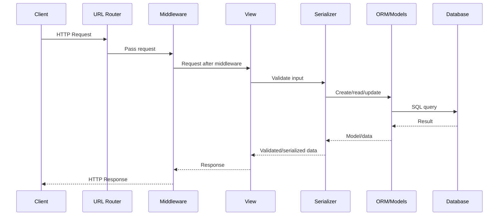
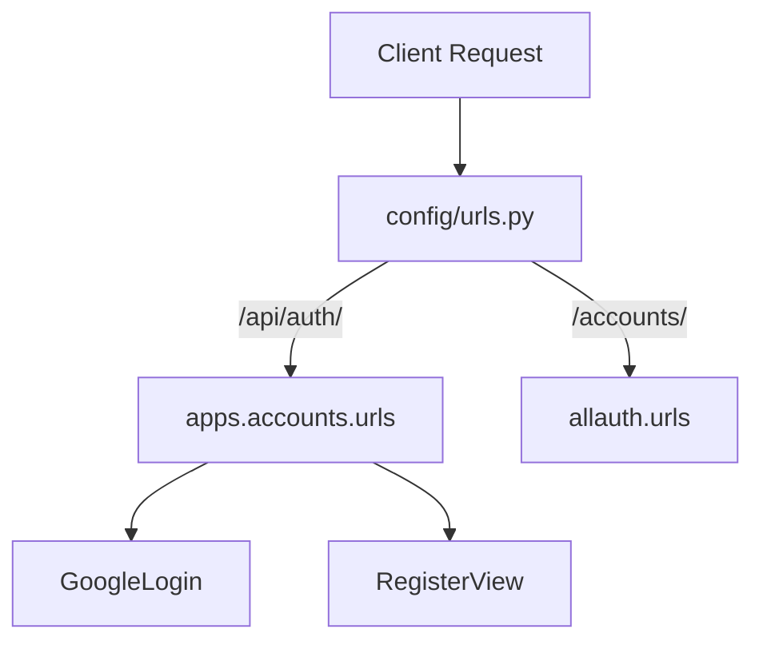
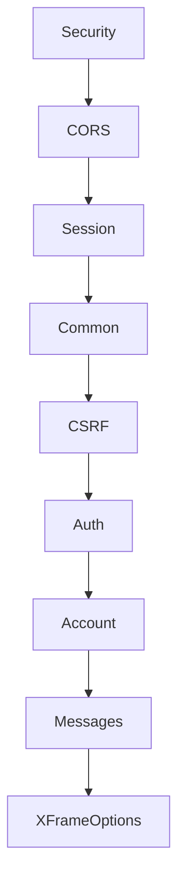
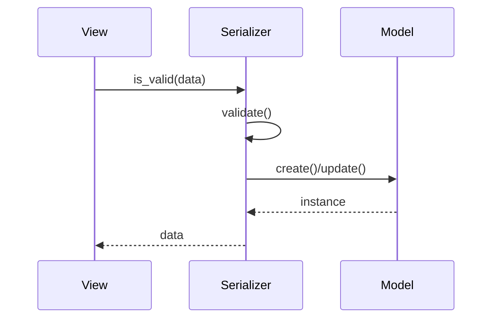
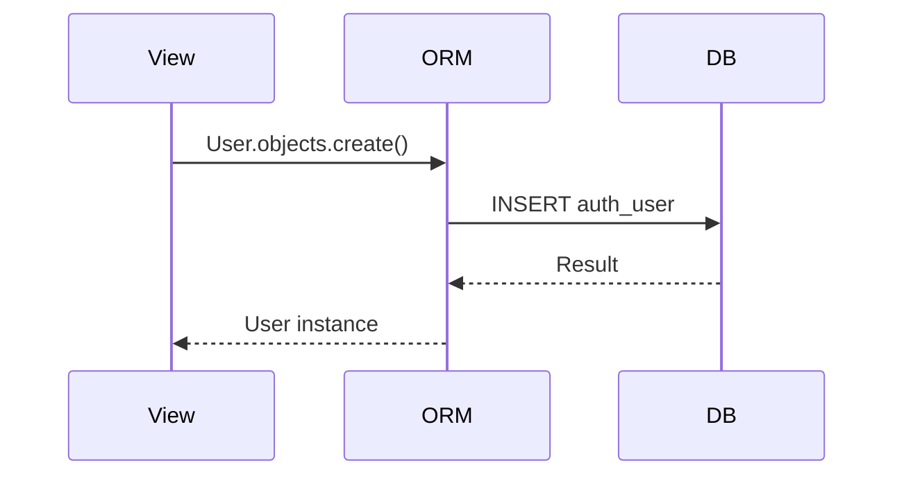
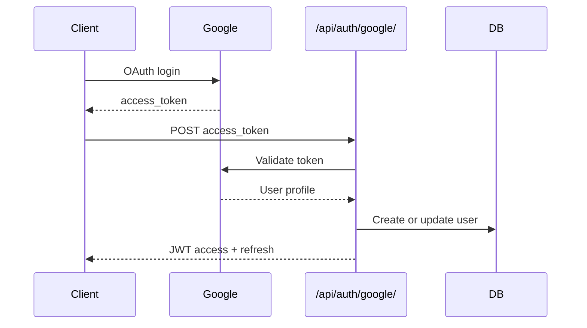
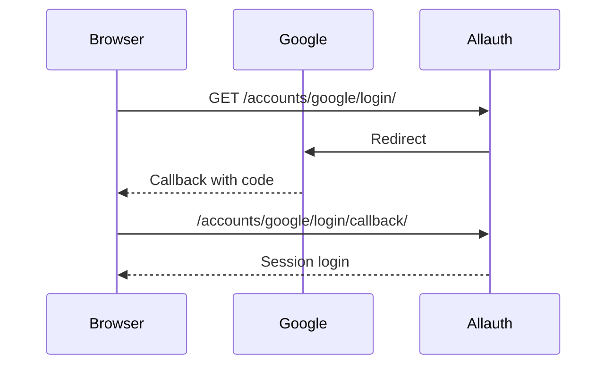
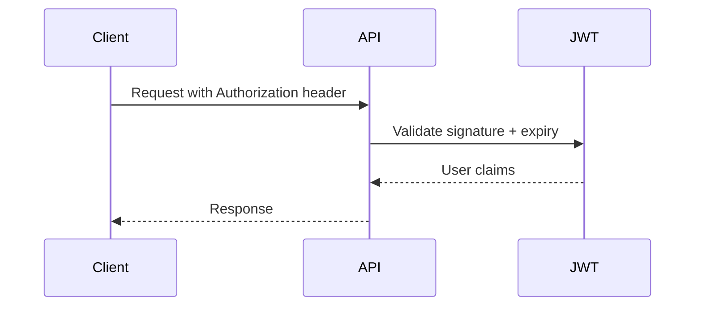
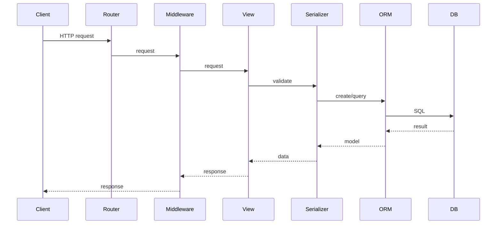
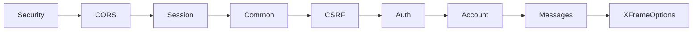

# Project Workflow Documentation

## Overview
This document describes the backend architecture and request/response workflows for this Django REST Framework project. It covers authentication (JWT + Google OAuth), routing, middleware, serializers, models, and database flow. It also includes diagrams and practical request/response examples.

---

## 1. Project Architecture

### 1.1 Folder Layout (High Level)
- config/
  - Project configuration and Django settings.
  - Root URL routing and ASGI/WSGI entry points.
- apps/
  - Feature modules (Django apps).
  - accounts/ contains authentication and user-facing APIs.
- utils/
  - Shared helper utilities (JWT helpers, response helpers, etc.).
- static/ and media/
  - Static files and uploaded media.
- logs/
  - Server and app logs (runtime environment only).

### 1.2 Accounts App Structure
- serializers.py
  - Input validation and output formatting.
- views.py
  - API endpoints (Register, Login, Refresh, Logout, Profile).
- services.py
  - Business logic (create user, authenticate, token issue).
- permissions.py
  - Permission classes to control access.
- validators.py
  - Reusable email and password validation helpers.
- urls.py
  - Local routing for auth endpoints.
- models.py
  - Model definitions (using default Django User model here).
- migrations/
  - Database migration history.

### 1.3 Purpose of Each Layer
- urls.py
  - Maps incoming request paths to view handlers.
- views.py
  - Orchestrates request lifecycle and returns structured responses.
- serializers.py
  - Validates and transforms input/output payloads.
- services.py
  - Encapsulates core logic to keep views thin and testable.
- models.py
  - Database schema and ORM mapping.
- utils/
  - Shared helpers for JWT and API responses.

---

## 2. Complete Django Request Lifecycle

### 2.1 Step-by-Step Flow
1. Client sends request (Postman / Browser / Frontend).
2. Django URL router matches the path.
3. Middleware runs in order (request phase).
4. View handles the request.
5. Serializer validates input and prepares data.
6. Model and ORM interact with database.
7. Serializer formats response data.
8. View returns a JSON Response.
9. Middleware runs in reverse order (response phase).

### 2.2 Lifecycle Diagram


---

## 3. Route-by-Route Workflow

### 3.1 Root URL Routing
Root router (config/urls.py):
- /admin/
- /api/auth/
- /accounts/ (allauth browser flow)

### 3.2 API Endpoints (apps.accounts)

#### POST /api/auth/register/
Purpose: Create a new user account.
- Auth: AllowAny
- Serializer: RegisterSerializer
- Service: create_user
- DB: Create User in auth_user

Example Request:
```json
{
  "email": "user@example.com",
  "password": "StrongPass123",
  "password_confirm": "StrongPass123",
  "first_name": "Jane",
  "last_name": "Doe"
}
```
Example Response:
```json
{
  "success": true,
  "message": "Registration successful",
  "data": {
    "id": 1,
    "email": "user@example.com",
    "first_name": "Jane",
    "last_name": "Doe",
    "is_active": true,
    "date_joined": "2026-05-23T00:00:00Z"
  }
}
```

#### POST /api/auth/login/
Purpose: Authenticate user and issue JWT tokens.
- Auth: AllowAny
- Serializer: LoginSerializer
- Service: authenticate_user, issue_tokens
- DB: Read User from auth_user

Example Request:
```json
{
  "email": "user@example.com",
  "password": "StrongPass123"
}
```
Example Response:
```json
{
  "success": true,
  "message": "Login successful",
  "data": {
    "user": {
      "id": 1,
      "email": "user@example.com",
      "first_name": "Jane",
      "last_name": "Doe",
      "is_active": true,
      "date_joined": "2026-05-23T00:00:00Z"
    },
    "tokens": {
      "access": "<jwt-access>",
      "refresh": "<jwt-refresh>"
    }
  }
}
```

#### POST /api/auth/refresh/
Purpose: Refresh access token.
- Auth: AllowAny
- Serializer: RefreshSerializer
- DB: token_blacklist tables (if configured)

Example Request:
```json
{
  "refresh": "<jwt-refresh>"
}
```
Example Response:
```json
{
  "success": true,
  "message": "Token refreshed",
  "data": {
    "access": "<new-jwt-access>",
    "refresh": "<new-jwt-refresh>"
  }
}
```

#### POST /api/auth/logout/
Purpose: Blacklist refresh token.
- Auth: IsAuthenticatedAndActive
- Serializer: LogoutSerializer
- DB: token_blacklist tables

Example Request:
```json
{
  "refresh": "<jwt-refresh>"
}
```
Example Response:
```json
{
  "success": true,
  "message": "Logout successful",
  "data": null
}
```

#### GET /api/auth/profile/
Purpose: Get current user profile.
- Auth: IsAuthenticatedAndActive
- Serializer: ProfileSerializer
- DB: Read User from auth_user

Example Response:
```json
{
  "success": true,
  "message": "Profile retrieved",
  "data": {
    "id": 1,
    "email": "user@example.com",
    "first_name": "Jane",
    "last_name": "Doe",
    "is_active": true,
    "date_joined": "2026-05-23T00:00:00Z"
  }
}
```

#### POST /api/auth/google/
Purpose: Exchange Google access_token or code for JWT tokens.
- Auth: AllowAny
- View: GoogleLogin (SocialLoginView)
- Provider: GoogleOAuth2Adapter
- DB: socialaccount_socialaccount, socialaccount_socialtoken, auth_user

Example Request:
```json
{
  "access_token": "GOOGLE_ACCESS_TOKEN"
}
```
Example Response:
```json
{
  "access": "<jwt-access>",
  "refresh": "<jwt-refresh>",
  "user": {
    "email": "user@gmail.com"
  }
}
```

### 3.3 Allauth Browser Routes (Partial)
These come from allauth when /accounts/ is included. Important ones for Google flow:
- GET /accounts/google/login/
- GET /accounts/google/login/callback/

These routes manage browser-based OAuth flow and are not intended for Postman API usage.

---

## 4. URL Routing System

### 4.1 Root Routing
```python
path("api/auth/", include("apps.accounts.urls"))
path("accounts/", include("allauth.urls"))
```

### 4.2 include() Explanation
- `include("apps.accounts.urls")` tells Django to load the child urls from the accounts app.
- `path("api/auth/", ...)` prefixes all child routes with `/api/auth/`.
- Example: `google/` becomes `/api/auth/google/`.

### 4.3 Routing Diagram


---

## 5. Authentication System

### 5.1 JWT Authentication
- Access token used in Authorization header: `Bearer <token>`.
- Refresh token used to generate new access token.
- Token rotation enabled; old refresh tokens are blacklisted.

### 5.2 Session Authentication
- Used for browser-based admin and allauth flows.
- Session cookie is set when logged in via browser.

### 5.3 Google OAuth Login
- API flow uses `SocialLoginView` and Google access token.
- Browser flow uses allauth redirect + callback.

### 5.4 Browser vs API
- Browser login: `/accounts/google/login/`
- API login: `/api/auth/google/`

---

## 6. Middleware Workflow

Middleware runs in order on request, and reverse order on response.

- SecurityMiddleware
  - Sets security headers.
- CorsMiddleware
  - Handles CORS headers.
- SessionMiddleware
  - Loads session data.
- CommonMiddleware
  - Handles URL normalization.
- CsrfViewMiddleware
  - Enforces CSRF checks.
- AuthenticationMiddleware
  - Populates request.user.
- AccountMiddleware
  - allauth account state.
- MessageMiddleware
  - Temporary message storage.
- XFrameOptionsMiddleware
  - Prevents clickjacking.

Middleware order diagram:


---

## 7. Serializer Workflow

- Validation phase: `is_valid()`
- Deserialization: JSON to Python data
- create()/update(): model save logic
- Serialization: model to JSON

Serializer lifecycle diagram:


---

## 8. Model and Database Workflow

- ORM builds SQL queries based on QuerySets.
- Database tables include:
  - auth_user
  - socialaccount_socialaccount
  - socialaccount_socialtoken
  - token_blacklist_outstandingtoken
  - token_blacklist_blacklistedtoken

Migrations track schema changes and sync them to MySQL.

Database flow diagram:


---

## 9. Google OAuth Workflow

### 9.1 API Flow (access_token)


### 9.2 Browser Flow (redirect)


---

## 10. JWT Workflow

- Access token: short-lived, required for protected endpoints.
- Refresh token: long-lived, used to get new access tokens.
- Rotation: refresh token changes on each refresh.
- Blacklist: old refresh token becomes invalid.

JWT validation flow:


---

## 11. Error Handling System

Common responses:
- 400: validation errors, missing fields
- 401: missing/invalid auth
- 403: permission denied
- 404: route not found
- redirect_uri_mismatch: incorrect Google redirect URI

Serializer errors include field-level messages for easier debugging.

---

## 12. Security Architecture

- CORS: controls allowed origins
- CSRF: protects browser session endpoints
- HTTPS: recommended in production
- Secure cookies: optional based on env
- JWT expiration: access tokens are short-lived
- Token storage: store securely (avoid localStorage in browsers for sensitive apps)

---

## 13. Detailed Sequence Diagrams

### Request Lifecycle


### Middleware Order


### Serializer Flow
```mermaid
flowchart TD
    A[Request Data] --> B[Serializer.is_valid]
    B --> C[validate()]
    C --> D[create/update]
    D --> E[Serializer.data]
    E --> F[Response]
```

---

## 14. Function-Level Explanation

- APIView
  - Base class for REST endpoints.
  - Receives request and returns Response.

- Serializer / ModelSerializer
  - Validates and transforms data.
  - create() and update() handle model persistence.

- SocialLoginView
  - Handles OAuth login flow for social providers.

- GoogleOAuth2Adapter
  - Connects allauth to Google OAuth endpoints.

- OAuth2Client
  - Handles OAuth2 token exchange.

- JWTAuthentication
  - Reads Bearer token, validates, sets request.user.

---

## 15. End-to-End Example

Scenario: User logs in with Google using API flow.

1. Frontend gets `access_token` from Google OAuth.
2. Frontend sends POST `/api/auth/google/` with token.
3. Django routes to GoogleLogin view.
4. SocialLoginView validates token with Google.
5. allauth creates/updates user and social account.
6. JWT tokens are returned in JSON response.

Example Response:
```json
{
  "access": "<jwt-access>",
  "refresh": "<jwt-refresh>",
  "user": {
    "email": "user@gmail.com"
  }
}
```
